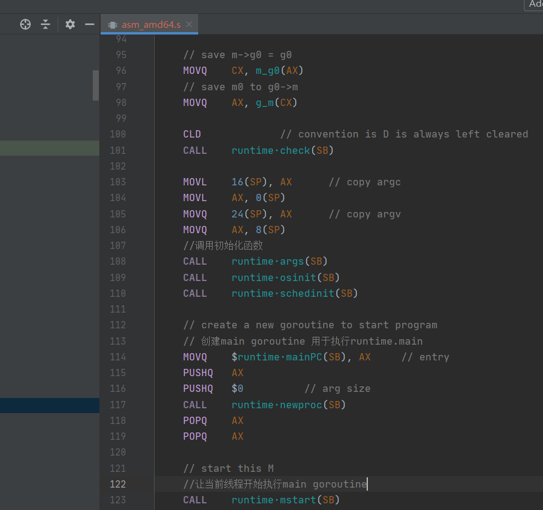

# 引导

事实上，编译好的可执⾏⽂件真正执⾏⼊⼜并⾮我们所写的 main.main 函数，因为编译器总是会插⼊⼀段引导代码，完成诸如命令⾏参数、运⾏时初始化等⼯作，然后才会进⼊⽤户逻辑。  

要从 src/runtime ⽬录下的⼀堆⽂件中找到真正的⼊口，其实很容易。随便准备⼀个编译好的⽬标⽂件，⽐如 “Hello, World!”。

test.go

```go
package main
func main() {
    println("hello, world!")
}
```
编译，然后⽤ `GDB` 查看。
建议：尽可能使⽤命令⾏编译，⽽不是某些 IDE 的菜单命令，这有助于我们熟悉各种编译开关参数的具体功能。其次，调试程序时，建议使⽤ `-gcflags "-N -l"` 参数关闭编译器代码优化和函数内联，避免断点和单步执⾏⽆法准确对应源码⾏，避免⼩函数和局部变量被优化掉。  

`$ go build -gcflags "-N -l" -o test test.go`
如果在平台使⽤交叉编译（Cross Compile），需要设置 GOOS 环境变量。  

```
$ gdb test
(gdb) info files
Local exec file:
Entry point: 0x44dd00
(gdb) b *0x44dd00
Breakpoint 1 at 0x44dd00: file /usr/local/go/src/runtime/rt0_linux_amd64.s, line 8.
```

很简单，找到真正的⼊⼜地址，然后利⽤断点命令就可以轻松找到⽬标源⽂件信息。  

定位到真正的入口文件 rt0_linux_amd64.s

从这个文件开始阅读起，这个文件是汇编，除了汇编文件之外，剩下的均可用go语言来进行阅读了，这个汇编也算是比较简单的，我在底层篇完结的时候上传我的注释代码到这里，到时候可以使用go1.4来编译下go1.5.1了... 是不是很爽啊。  

可以cat看看也行 

打个断 
  

看到代码位于asm_amd64.s  

代码走一走 /usr/local/go/src/runtime/asm_amd64.s

  

对了 忘记说，你也可以直接解压我放在这个目录下的src压缩包 直接用goland去读一读，也能用goland的远程调试配ssh连接代码目录

到这，就算灰白你引导过程结束了，基本上后续都是go代码了...  

# 初始化

一样 设置断点，找到函数所在的源文件名和代码行数，直观的看代码比较好。

  

找到位置后阅读以下

