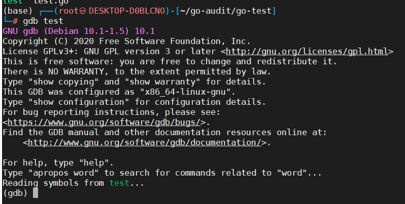
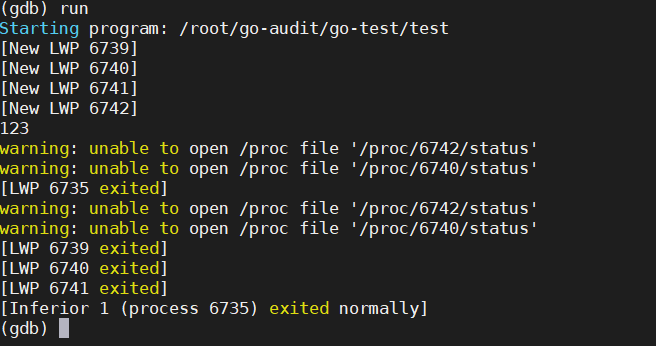
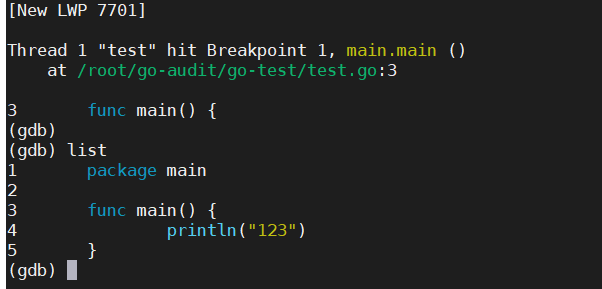

# gdb基础使用指南

例子还是之前test.go 就是一个helloworld。

gdb test

  

出现了Reading symbols from test...

就算是载入成功了。   
启动之后首先看看这个程序是不是可以运行起来,只要输入run命令回车后程序就开始运行,程序正常的话可以看到程序输出如下,和我们在命令行直接执行程序输出是一样的：

  

  

上面例子b 2表示在第2行设置了断点,之后输入run开始运行程序,现在程序在前面设置断点的地方停住了,我们需要查看断点相应上下文的源码,输入list就可以看到源码显示从当前停止行的前几行开始：


  

现在GDB在运行当前的程序的环境中已经保留了一些有用的调试信息,我们只需打印出相应的变量,查看相应变量的类型及值：

```
(gdb) info locals
isexit = 0
count = 1
c = 0xc210039060
(gdb) p count
$1 = 1
(gdb) p c
$2 = (chan int) 0xc210039060
(gdb) whatis c
type = chan int
```

每次输入c之后都会执行一次代码,又跳到下一次for循环,继续打印出来相应的信息,设想目前需要改变上下文相关变量的信息,跳过一些过程,得出修改后想要的结果：

 
```
(gdb) info locals
isexit = 0
count = 2
c = 0xf840001a50
(gdb) set variable isexit=1
(gdb) info locals
isexit = 1
count = 3
c = 0xf840001a50
(gdb) c
Continuing.
c: 3
main end
[LWP 11588 exited]
[Inferior 1 (process 11588) exited normally]
``` 

最后稍微思考一下，前面整个程序运行的过程中到底创建了多少个goroutine，每个goroutine都在做什么：

 
```
(gdb) run
The program being debugged has been started already.
Start it from the beginning? (y or n) y
Starting program: /root/go-audit/go-test/test 
warning: no loadable sections found in added symbol-file system-supplied DSO at 0x2aaaaaaab000
main start

Breakpoint 2, main.main () at /root/go-audit/go-test/test.go:25
25                      fmt.Println("c:", count)
(gdb) info goroutines 
* 1  running runtime.park
* 2  syscall runtime.notetsleepg
  3  waiting runtime.park
  4 runnable runtime.park
(gdb) goroutine 3 bt
#0  0x0000000000415586 in runtime.park (unlockf=void, lock=void, reason=void) at /usr/local/go/src/pkg/runtime/proc.c:1342
#1  0x0000000000420084 in runtime.tsleep (ns=void, reason=void) at /usr/local/go/src/pkg/runtime/time.goc:79
#2  0x000000000041ffb1 in time.Sleep (ns=void) at /usr/local/go/src/pkg/runtime/time.goc:31
#3  0x0000000000400c38 in main.counting (c=0xc210039060) at /root/go-audit/go-test/test.go:10
#4  0x0000000000415750 in ?? () at /usr/local/go/src/pkg/runtime/proc.c:1385
#5  0x000000c210039060 in ?? ()
#6  0x0000000000000000 in ?? ()
``` 

 

通过查看goroutines的命令我们可以清楚地了解goruntine内部是怎么执行的，每个函数的调用顺序已经明明白白地显示出来了.

本文简单介绍了GDB调试Go程序的一些基本命令,通过上面的例子演示,如果你想获取更多的调试技巧请参考官方网站的GDB调试手册,还有GDB官方网站的手册